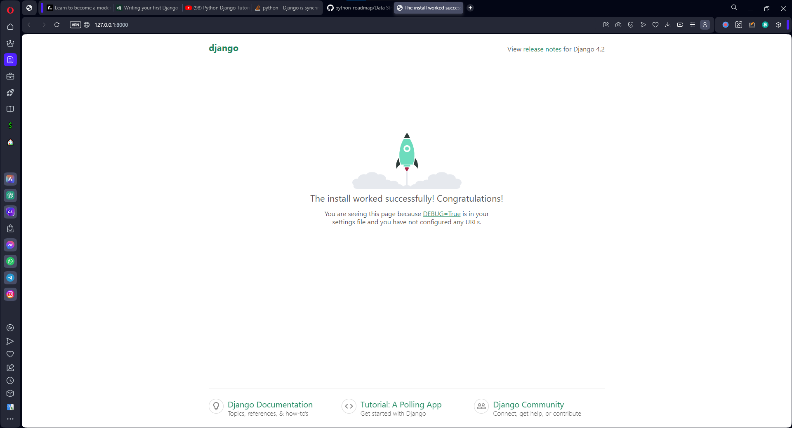

# Django

## Unchained? Or just speedy?

Django is a synchronous, open-source web development framework that was designed to streamline otherwise long-winded and complex tasks such as user authentication, content administration, site maps and RSS feeds. It is also easily scalable :)

It utilises the model-template-view architecture that is common in web development

I'm gonna need to dedicate some real time to this, so here's a few quick links for me to refer to, and for everyone to see where I'm getting my information from:

> - [Django Tutorial](https://docs.djangoproject.com/en/4.2/intro/tutorial01/)
> - [YouTube Tutorial](https://www.youtube.com/watch?v=rHux0gMZ3Eg) (1 hr)

## The YouTube Video

I'm just gonna make a few notes on each of the sections as I'm watching the video.

A huge number of large companies use Django in their tech stack because it is so useful and ubiquitous to learn. It also makes creating developer APIs easy (take Spotify for example, I've looked at their API a little bit).

Django isn't the fastest thing in the world, but that's not so much a problem because of the amount of versatility it provides. Some think that the optional features that come default with Django are just bloatware, but it doesn't make so much a difference.

### Some basic Web Fundamentals

A website will have two main features: the frontend and backend. The frontend is the pretty bit that a user will interact with, while the backend is all the processing that carries out tasks that the frontend creates. For example, accessing a webpage by clicking a link (on the user interface) sends a request from the client to the server, where the request is processed and a webpage is sent as a response by the backend of the site. This backend may have handled a few operations like data access and user authentication.

The request-response system is handled by the server by following the Hypertext Transfer Protocol (HTTP). The web server decides how to respond to the client's request. Either the server will generate a new HTML document for the client based on the request, and send it back; otherwise, data can be sent back to the client to be processed by the client's machine and update an HTML document that way. The latter is preferred by today's standards as it frees up some processing space server-side to allow for a higher number of clients, increasing scalability.

Django is a server-side framework that puts the processing responsibility on the client. This essentially makes the server a gateway to the data, that a client accesses via an API (Application Program Interface) with multiple endpoints for the user to interact with.

### Setting up the Development Environment

It's always a good idea when creating a new backend that we only have the things we want / need in our environment, so it's always good to have a clean slate Python environment. There are lots of packages that can create a Python environment for you, but for this video, we just use pipenv.

Gotta install pipenv using 

`pip install pipenv --user`

and we use `--user` because we need to bypass admin access to some folders to install it smh. Once that's installed, we go to the folder in which we would like to create a new environment and we enter

`pipenv install django`

This will create a new environment and install Django on it. This will create a `.virtualenvs` folder in your user drive, which contains all the virtual environments set up by pipenv. I'd like to say you can change the names of environments in the `.virtualenvs` folder but the names are hashes of the parent folder you created the environment in and need to stay that way. Renaming is done by just recreating the environment by copying and pasting with a new name \*sigh\*

Once that's all done, I can go into the command line shell set up by the pipenv using `pipenv shell` - simple enough, right? Here, I don't have any of my other packages installed, except for the ones that come prepackaged with whatever version of Python I have installed on the environment. It defaults to the latest one btw.

Now I can start creating the Django application! Let's say I want to create an application for a storefront, so I'm going to create one. I do this by typing

`django-admin startproject storefront`

which creates a project folder containing a folder for the core of the program, as well as a file called `manage.py`. Both folders named the same, confusingly. We can avoid this by placing a `.` as an argument at the end of the above command. This tells django-admin to use the current directory as the project folder instead of creating a new one. *However*, it is probably worth considering that each project should get its own development environment, so we're going to make a new folder, then create the environment in there, then run the command with a `.` so we still have that double-name structure, but with its own environment

Now, we have the folder `storefront` that acts as a package full of modules (`__init__.py`, `asgi.py`, `settings.py`, `urls.py`, and `wsgi.py`), as well as `manage.py`. This last file is actually a wrapper around `django-admin`, but taking the Django environment into account.

With this in mind, we now need to start typing `python manage.py` into the terminal in place of `django-admin`. Since it is a wrapper, the same functions can be used, including `runserver`. This does what it says on the tin and runs your application on the local server from whatever port you specify. It defaults to port 8000. Pressing Ctrl-C in the terminal will terminate the server.


> Django is running successfully if you see this window pop up

Another important part of setting up the environment is ensuring your Python interpreter is set to the venv's Python version. You can do this by changing the interpreter to the python script found in the venv's `Scripts` folder. As well as this, it really helps to have the terminal inside VS Code, so you don't have to have it in a separate command prompt. This ensures everything is done in the virtual environment because your VS Code is running in the venv.

#### Updated later: OMG I FORGOT TO TALK ABOUT LAUNCH.JSON

Okay so `launch.json` is the JSON file used by VS Code to launch your code project. This needs to be configured so that you can just smash F5 to launch your project rather than typing out a bunch of command line stuff. Plus, this way it's consistent every time you launch.

Go to the Run and Debug section of VS Code (Ctrl + Shift + D), and click create a launch.json file, while a python file is open. Select Django from the list. Now you want to change a few parameters. `"program"` needs to point to your manage.py file, either in absolute terms or using the relative path pointer `${workspaceFolder}`. In this instance, because I have my workspace set to a level higher than my project, I have to add the project folder into the path. Next, you also want to make sure your args are correct. By default, "runserver" is the only argument passed, but you can have others. Maybe if you want to default your port to another, you can add "8000" (for example) to the list. Also, if you'd like to change the IP address of your server, you can do this as well - "0.0.0.0:8000" (which is a public IP that can be accessed by all computers on the network - useful for showing other people what you've done without actually having the project on a www server).

### Creating your first App

An app is something that provides a specific service. In your Django project (in this case, storefront), you can go to the `settings.py` file and check out the list of `INSTALLED_APPS`. By default, the ones in the list are apps that Django uses to launch a server and serve data to clients. `django.contrib.admin` is the app that provides the admin UI, `auth` provides user authentication, `messages` gives one-time pop up messages to the user, `sessions` is purely legacy - it was used to cache data for the user - and `staticfiles` are the files that are sent to the user such as CSS files and images.

We want new functionality, and a new app to run on our server. We do this in our terminal using `python manage.py startapp [name]`. In this case, we're just gonna call it `NewApp`. What this does is it creates a new folder next to the core `storefront` package containing a few items. The first is a folder called `migrations` which initially contains an empty `__init__.py` file. The other files are `admin`, `apps`, `models`, `tests`, and `views`. These files control how the admin page looks, configurations for the application, how data is pulled from a database, unit tests, and how requests are handled, respectively.

So now we have the app, we need to add it to our list of `INSTALLED_APPS` by simply adding the name of it to the list as a string.

### Let's talk about Views

What is a view? A view refers to the presentation layer of a web app or site. This is what the user sees. It is also used to separate the code managing the data models from the code managing the user interface.

The views module is used to manage requests and return responses and is called a request handler (this module is NOT the the stuff the user sees, it just manages their requests. Because of this, other frameworks refer to this as actions, rather than views).

In the context of `views.py`, a view is actually a function that returns an HTTP response. Let's give an example (very simple)

```python
from django.http import HttpResponse

def say_hello(request):
    return HttpResponse("Hello!")
```

All request handlers need to accept a request as a parameter. Now that we have a very simple function that'll return an HTTP response to the user, we need to map it to a URL that other parts of the application can access.

We can do this by adding a new file to the `NewApp` package. it'll just be called `urls.py`. This name is just conventional and can be anything you like, but we'll keep it this way for simplicity. This file will look like this for now:

```python
from django.urls import path
from . import views

# URLConf
urlpatterns = [
    path('NewApp/hello', views.say_hello) # reference to method, not calling it
]
```

This is all well and good on its own, and does what it needs to, but we also want to be able to access this from the core package. We do this by going to the `urls.py` file in `storefront` and adding this new `urls.py` file to the list of `urlpatterns`.

This is done in the following way:

```python
### storefront/urls.py
from django.contrib import admin
from django.urls import path, include

urlpatterns = [
    path('admin/', admin.site.urls),
    path('NewApp/', include('NewApp.urls'))
]
```

Now that we have told the core package that if we get a request for anything that starts with `NewApp/`, it should reroute it using the `NewApp.urls` module, we can remove the `NewApp/` bit from the other URLConf list so we have just `path('hello/', views.say_hello)`. Nice. Be aware that now that we have configured our own URL, the startup Debug page for your Django app will not work and you'll get a 404 error. This is fine, just shocked me a little bit lmao.

### Templates

Templates are more similar to what a frontend developer would call a view. This is what the user actually does see, rather than the way the app handles a request, which is what a view does in Django. Weird, but it is what it is. Anyway, templates are the things that the user sees. They're called templates because they can be dynamically filled depending on what data is accessed by a client. We'll make a new folder to keep these in, inside the NewApp package. Apparently Django likes everything in lowercase, so we'll call it `templates`. Here, we'll keep a bunch of HTML files

The first one we'll call `hello.html` and we'll just put some really simple HTML in it. Now, we need to be able to display this to a user using a view. Remember the view function we made earlier? Let's change that up a bit:

```python
from django.shortcuts import render

def say_hello(request):
    return render(request, 'hello.html')
```

This uses the `render` method to return a HttpResponse object. It takes the request as the first parameter, then fetches the `hello.html` template from the templates folder. Doesn't need to be explicitly routed because Django expects templates to be found in the templates folder.

#### What if we want something more interesting than plain text in HTML?

We can dynamically add things to the HTML document by passing them as arguments to the render method. The render method takes a Mapping type object to map a string to Any object. Typically a good datatype for this is a dictionary. Now we essentially have variables that get passed to the HTML document that are accessed via the notation `{{ var }}`.

Let's say I want to dynamically change the name displayed by the text in the header. I can do this like so:

```python
# Python
from django.shortcuts import render

def say_hello(request):
    return render(request, 'hello.html',
                  {'name': 'Will'})
```
```html
<!HTML>
<h1>Hello World! I'm {{ name }}!</h1>
```

And this opens up a whole world of possibilities! As long as I set up the HTML page correctly, I can use these variables anywhere and dynamically set their values to any type of object!

OH MY GOD YOU CAN WRITE LOGIC IN THE HTML???

Okay okay so we can write logic for this really simply:

```html

<h1>Hello {{ name }}!</h1>

<h1>Hello World!</h1>
             <!Important>
```

And that's the gist of it.

To be fair, templates are not wholly important these days as Django apps are so rarely used to directly provide people with an HTML file, dynamic or otherwise, but are used for APIs and data access.

### Debugging with django-debug-toolbar

When you're debugging Python code, it's as easy as creating a breakpoint in your code. However, when it comes to handling debugging issues with a webapp, there are other ways of doing it that are relatively straightforward and intuitive. For example, the django-debug-toolbar is a useful tool for seeing what traffic is flowing through your debugging session, and where things may be going wrong or different to your expectations.

#### Installing and using the Toolbar

like a lot of other tools you'll use with Django, it needs to be installed to your virtual environment. Enter into your virtual environment in the command line / terminal and type:

`pipenv install django-debug-toolbar`

and it'll install it to your environment. Make sure you're in the right folder or it'll create a new environment without the base Django in it, not helpful. If you do, make sure you delete the new unwanted environment using `pipenv --rm`

Now you have it installed, you need to make sure you can use it in your webapp. It is more or less just a case of adding some things to your `settings.py` file.

You want to add `'debug_toolbar'` to your list of `INSTALLED_APPS`, and `'debug_toolbar.middleware.DebugToolbarMiddleware'` to your list of `MIDDLEWARE`. As well as this, it's a good idea to add a new constant called `INTERNAL_IPS` and set it to `'127.0.0.1`. All of this can be done with a small bit of code at the end of the `settings.py` file:

```python
if DEBUG:
    import mimetypes

    mimetypes.add_type("applications/javascript", ".js", True)
    INTERNAL_IPS = ('127.0.0.1',)
    INSTALLED_APPS += ['debug_toolbar']
    MIDDLEWARE += ['debug_toolbar.middleware.DebugToolbarMiddleware']
```

This includes a little bit about mimetypes. I'm not sure what this means, but it causes issues with Windows machines in that they don't typically know by default how to run a Javascript application (which is what the toolbar is) through Python. That's what the `mimetypes.add_type` method does. It tells the interpreter to mimic .js files as if they were Python, I think?

Really useful toolbar to have for picking apart things that are going on and wrong. You can also see what SQL queries are being sent as part of requests which is interesting.

### Data Models

This whole section is about designing a relational database. It's not gonna be easy to write down about here, but I've gone over this sort of thing a lot over the years.

For an e-commerce structure, there are a few classes of data that we need to represent the things the user can interact with. The first obvious one is the Product class. This will have several relevant attributes like name, description, quantity, and price. Products may also fall under departments or categories. This will have a name attribute and frankly little else. the relationship between Product and Dept may be many to 1 or even many to many. There are other relations that these two classes could have, like an optional featured_product for each department. An optional relationship is designated by 0..1 meaning 'zero to one'.

In Django, we do not need to specify an ID for each class, as these are generated for us.

Another entity we need in a shop is a Cart. Carts can contain many products and a product can be found in multiple carts. This creates a many-to-many relationship and these can be difficult to deal with when it comes to having definite, countable attributes since it requres the relationship itself have attributes. This is where we'd break up the many-to-many relationship using an associated class - CartItem. Product has a one-to-many relationship with CartItem and CartItem has a many-to-one relationship with Cart - one product may be references by many CartItems, and one Cart may contain many CartItems.

Another entity we need is Customer. This is where a user's profile will be created with things like name, email, phone number, password, etc. Customers create orders when they buy things. This is another entity that is needed by the e-commerce app. One customer may have many orders, but one order cannot have more than one customer. An Order object contains products and a product can be found in multiple Orders. This is another many-to-many relationship that can be broken up with an association class the same way as the product-Cart relationship.

### Now we have our Relationship Model, let's put this into Django

Before we start, a thing about scalability. The thing about this model is that if we keep it all in one app, it can become bloated and harder to maintain as the need for new functionality arises. Having a single "Store" application can lead to this as more entities are introduced. The sensible solution to this is to create more apps that have more specific functions - maybe we have "Products", "Carts", "Orders", "Customers" apps. These are all modular and would work just fine, but they have a lot of dependencies between each other. This means that while it is modular and easier to maintain, you still have to install and update each module every time, rather than just having it update as a single package. This defeats the point of making things easier to maintain. The dependencies between these modular apps will cause more issues if you update one and not another. 

So what we do is we find a middle ground by creating apps for things only if they can be unrelated to the things that have dependencies. For example, if an entity was not entirely dependent on another, but still had a relationship, this could be removed and placed in another App.

### Okay, for real, let's make a Store App

Just like when we made the `NewApp` App, we're gonna go into our pipenv shell, in the right directory, and create a new app called `Store`. This creates all the same .py files as before in a new package called Store. This needs to be added to the list of `INSTALLED_APPS` again and hey presto, we have everything we need to start implementing the Store to our webapp.

SADLY, that is where the video ends as it is the first part of a 10 hour course. Maybe one day I'll look into getting the course if it isn't too pricey. But until then, I'm going to look at the official starting guide to help out.

## The Beginner's Guide

### Starting on Section 2: Database Setup

By default, Django uses SQLite to manage databases. This is a good starting point when learning to use SQL with Python, but doesn't have many options for scalability, unlike PostgreSQL. You can see the settings for Django's database management in the `DATABASES` constant in `settings.py`. Depending on which backend you want to use, you have to change the settings there. The `'ENGINE'` key can have many values. Supported backends include SQLite (`'django.db.backends.sqlite3'`), PostgreSQL (`'django.db.backends.postgresql'`), MySQL (`'django.db.backends.mysql'`), and Oracle (`'django.db.backends.oracle'`). Others are also available [here](https://docs.djangoproject.com/en/4.2/ref/databases/#third-party-notes). For engines other than SQLite, other parameters must be added including `'USER'`, `'PASSWORD'`, `'HOST'`, and `'PORT'`. Documentation for this can be found [here](https://docs.djangoproject.com/en/4.2/ref/settings/#std-setting-DATABASES). Damn.

The `'NAME'` parameter is the full path and file name of the file that will hold your database. By default, it is `db.sqlite3`, found in the same directory as `manage.py`. This can be changed to whatever you like as long as it has the right file extension for your engine.

### Models

A model, in terms of Django's thoughts, is the source of information about your data. It contains the fields and behaviours of data you're storing. Essentially, they are each classes that outline what information your data holds and things you can do with that data.

It really helps to have an idea of how your data classes all associate with each other - genuinely grab a whiteboard and write it out. This way, you've got your relationships outlines and you know what you can do with each class.

#### So, how are Models written?

Just like Python classes, except they don't need an `__init__` method which is nice.

Let's write out the data class for Product:

```python
class Product(models.Model):
    name = models.CharField("Product Name", max_length=256)
    description = models.TextField("Product Description", max_length=1024)
    quantity = models.IntegerField("Quantity")
    price = models.DecimalField("Price")
```

You'll notice that all our fields are designated by typed fields found in the `models` module. It can be useful to know the different types of data that can be entered here.

All of the field types supported by Django can be found [here](https://docs.djangoproject.com/en/4.2/ref/models/fields/#field-types) and it is definitely worthwhile reading the ones you need. Particularly the relationship fields. Each class you build here creates a new table in your database to represent your fields. That's pretty much it, carry on creating classes to represent the datatypes we set out [above](#data-models). In Django, it turns out that it is possible to create many to many relationships without an intermediary class, but still good practice anyway.

So this is what I've got so far:

```python
class Product(models.Model):
    name = models.CharField("Product Name", max_length=256)
    description = models.TextField("Product Description", max_length=1024)
    quantity = models.IntegerField("Quantity")
    price = models.DecimalField("Price")
    department = models.OneToOneField("Department", on_delete=models.CASCADE)

class Department(models.Model):
    department_name = models.CharField(max_length=64)
    product_highlight = models.OneToOneField(Product, on_delete=models.CASCADE, blank=True, null=True)

class Cart(models.Model):
    time_created = models.DateTimeField("Time Created")
    cart_items = models.ManyToManyField(Product)

class Customer(models.Model):
    first_name = models.CharField(max_length=32)
    family_name = models.CharField(max_length=32)    

class Order(models.Model):
    time_created = models.DateTimeField("Time Created")
    order_items = models.ManyToManyField(Product)
    customer = models.ForeignKey(Customer, on_delete=models.CASCADE)
```

When creating relationships between models, you need to be aware of what end of the relationship you're putting your `ForeignKey` in. The `ForeignKey` type designates a many to one relationship. For example, there is a many to one relationship between `Order` and `Customer`. We put the `ForeignKey` on the `Order` to relate the many orders to the one customer. In the case of `Department` and `Product`, they both have each other as a `OneToOneField` and this is because we designate `product_highlight` as an optional field that references a `Product`, and a `Product` can be found in just one department.

You'll notice that some of these fields just have strings as arguments, these are optional display names for the fields we're creating. It's a human-readable name that can be referenced. In future, I don't think I'll be using them unless things get really out of hand (but then it's just bad coding at that point).

Now that we have our models, we need to make sure our Django project knows they exist. We do this by making migrations in the terminal:

```python manage.py makemigrations Store```

This actually threw some errors at me regarding naming clashes as well as missing parameters from the `Product.price` - needed `max_digits` and `decimal_places`.

Anyway, now those are sorted, migrations have been made regarding the new models. Also, a new python file has been created in the migrations folder. This is basically like version control but for your models, because we all know that SQL errors can be fatal for databases. Nice to have as backup. It also shows how your different fields are made which is nice. If you'd like to see the SQL generated by these  migrations, you can type `python manage.py sqlmigrate Store 0001` and it'll output the actual SQL:

<details>
<summary>See SQL here</summary>

```sql
BEGIN;
--
-- Create model Customer
--
CREATE TABLE "Store_customer" ("id" integer NOT NULL PRIMARY KEY AUTOINCREMENT, "first_name" varchar(32) NOT NULL, "family_name" varchar(32) NOT NULL);
--
-- Create model Department
--
CREATE TABLE "Store_department" ("id" integer NOT NULL PRIMARY KEY AUTOINCREMENT, "department_name" varchar(64) NOT NULL);
--
-- Create model Product
--
CREATE TABLE "Store_product" ("id" integer NOT NULL PRIMARY KEY AUTOINCREMENT, "name" varchar(256) NOT NULL, "description" text NOT NULL, "quantity" integer NOT NULL, "price" decimal NOT NULL, "product_department_id" bigint NOT NULL UNIQUE REFERENCES "Store_department" ("id") DEFERRABLE INITIALLY DEFERRED);
--
-- Create model Order
--
CREATE TABLE "Store_order" ("id" integer NOT NULL PRIMARY KEY AUTOINCREMENT, "time_created" datetime NOT NULL, "order_customer_id" bigint NOT NULL REFERENCES "Store_customer" ("id") DEFERRABLE INITIALLY DEFERRED);
CREATE TABLE "Store_order_order_items" ("id" integer NOT NULL PRIMARY KEY AUTOINCREMENT, "order_id" bigint NOT NULL REFERENCES "Store_order" ("id") DEFERRABLE INITIALLY DEFERRED, "product_id" bigint NOT NULL REFERENCES "Store_product" ("id") DEFERRABLE INITIALLY DEFERRED);
--
-- Add field product_highlight to department
--
CREATE TABLE "new__Store_department" ("id" integer NOT NULL PRIMARY KEY AUTOINCREMENT, "department_name" varchar(64) NOT NULL, "product_highlight_id" bigint NULL UNIQUE REFERENCES "Store_product" ("id") DEFERRABLE INITIALLY DEFERRED);
INSERT INTO "new__Store_department" ("id", "department_name", "product_highlight_id") SELECT "id", "department_name", NULL FROM "Store_department";
DROP TABLE "Store_department";
ALTER TABLE "new__Store_department" RENAME TO "Store_department";
CREATE INDEX "Store_order_order_customer_id_ffe69ff1" ON "Store_order" ("order_customer_id");
CREATE UNIQUE INDEX "Store_order_order_items_order_id_product_id_3f8b2159_uniq" ON "Store_order_order_items" ("order_id", "product_id");
CREATE INDEX "Store_order_order_items_order_id_7cf9b5ed" ON "Store_order_order_items" ("order_id");
CREATE INDEX "Store_order_order_items_product_id_9532680c" ON "Store_order_order_items" ("product_id");
--
-- Create model Cart
--
CREATE TABLE "Store_cart" ("id" integer NOT NULL PRIMARY KEY AUTOINCREMENT, "time_created" datetime NOT NULL);
CREATE TABLE "Store_cart_cart_items" ("id" integer NOT NULL PRIMARY KEY AUTOINCREMENT, "cart_id" bigint NOT NULL REFERENCES "Store_cart" ("id") DEFERRABLE INITIALLY DEFERRED, "product_id" bigint NOT NULL REFERENCES "Store_product" ("id") DEFERRABLE INITIALLY DEFERRED);
CREATE UNIQUE INDEX "Store_cart_cart_items_cart_id_product_id_7ebfc4bc_uniq" ON "Store_cart_cart_items" ("cart_id", "product_id");
CREATE INDEX "Store_cart_cart_items_cart_id_a6368667" ON "Store_cart_cart_items" ("cart_id");
CREATE INDEX "Store_cart_cart_items_product_id_7d60b2b6" ON "Store_cart_cart_items" ("product_id");
COMMIT;
```

</details>

Another thing you can do before making migrations is to `manage.py check` them so that you don't accidentally modify your migrations.

Another way to do all of your migrations at once is to do `manage.py migrate` and this will migrate everything that isn't already migrated :) This is definitely a good thing to make sure you do, as this will create your data tables in the database

Now that we have our models set up, we need to start adding data to our database! How do we do this? Using the Django shell. You can enter this using `manage.py shell` and this will bring up a Python terminal that you can run scripts in. We do this because it automatically sets up your `DJANGO_SETTINGS_MODULE` to get to your settings.py file.

Let's do some Django in the shell:

```python
>>> from Store.models import *

# No products in the database yet
>>> Product.objects.all()
<QuerySet []>

# Let's make one!
>>> p = Product(name="Air Force 1", 
    description="A shoe", 
    quantity=3, 
    price=15.99, 
    product_department=Department("Shoes"))

# Slight issue here as we are essentially creating 
# a new department before creating the product.
# Bit backwards but the way to get around that is to save the 
# department as a new one before saving the product

# save the department, creating the department named "Shoes"
>>> p.product_department.save()

# then save the product named "Air Force 1"
>>> p.save()

# see now that our product has been saved to our database
>>> Product.objects.all()
<QuerySet [<Product: Product object (1)>]>
```

We can now access any of the records that are Products via the `Product.objects` manager. This can be used to query the database via `.get()` or `.filter()` or to return all objects via `.all()`.

You can also rename the manager to something that makes more sense:

```python
class Product(models.Model):
    # ...
    Products = models.Manager()
```

and this will replace `objects` with `Products`. A useful thing to be able to do when you're typing away is to save everything that you've updated. This is good when you forget to save as you update everything (this should be good practice anyway). The `all()` method returns a list that can be iterated through, meaning you can just do a for loop to iterate over all products, departments or anything else you need to do so for.

#### A quick aside on writing models

You'll have noticed that seeing something that says `<QuerySet [<Product: Product(1)>]>` is actually pretty disgusting. So let's change the string representation of our models using the `__str__()` method:

```python
def __str__(self):
        return self.name
```

#### Managers

Managers are a class used by Django to literally manage your dataclasses. By default, your models will have a manager to sort out queries. Managers are also for relationships, but these are called Base Managers. For example, a many-to-many relationship will have a `ManyToManyRelatedManager` that manages the set of items held in this relationship. For example, say I have a `Cart` with many items, we can see via `cart_items` (a many to many field) what Products are contained in the cart. All managers have common methods (and some with asynchronous counterparts) such as `.all()`, `.create()`, `.update()` (and `.bulk_create` and `.bulk_update`), `.count()`, `.first()` and `.last()`, `.delete()` and many more.

I'll look at `.get_queryset()` a little bit first. This returns a QuerySet just like `.all()`, but it is empty. This is the method that is called by `.all()` and has a default behaviour for the manager class. The default manager for all objects in a model returns the complete set, but `.get_queryset()` can be overridden by a new Manager class to return a modified set, depending on what you do to the set. A good example is given by the [documentation](https://docs.djangoproject.com/en/4.2/topics/db/managers/#modifying-a-manager-s-initial-queryset):

```python
class AuthorManager(models.Manager):
    def get_queryset(self):
        return super().get_queryset().filter(role="A")


class EditorManager(models.Manager):
    def get_queryset(self):
        return super().get_queryset().filter(role="E")


class Person(models.Model):
    first_name = models.CharField(max_length=50)
    last_name = models.CharField(max_length=50)
    role = models.CharField(
        max_length=1, choices=[("A", _("Author")), ("E", _("Editor"))]
    )
    people = models.Manager()
    authors = AuthorManager()
    editors = EditorManager()
```

This allows us to filter our complete set into Authors and Editors. As well as this, custom methods can be added to specific Managers for different behaviours. This allows us to sort of subclass models without specifying a new model - Authors and Editors are _kinds_ of Person, but are not separable from them. It is also worth mentioning that the first Manager assigned in a model becomes the default Manager for the model. This also means that if you'd like to keep the functionality of the original Manager, you need to reassign it first before any other managers, as above (`people = models.Manager()`).

### The Admin Page

Now, as much as we have been developing on here, we are not know to our own server that we are the administrator. We need to essentially just assign ourselves as admin by doing `py manage.py createsuperuser` and following the instructions that come up.

Now that we've created the admin user, we can log in using the admin page at [127.0.0.1:9000/admin](127.0.0.1:9000/admin) or whatever listening port you used to set it up. This is cool and all, we can see the users we have set up for our Django project and which of them are superusers or just staff lmao.

We can also use this page to see our models! we can do this by going into the `admin.py` module of our app and entering:

```python
from .models import *

admin.site.register(Product)
# and the same for the others
admin.site.register(Order)
```

Now, we can see and edit all our models and add and delete and update and do everything we need to be able to do with our models. Feels a bit better than creating instances by coding them myself.

### Next up, Views!

Views are what's next up in the getting started guide so let's have another look at them!

I think I may actually just go ahead and make a new project that isn't a Store, I wanted to make a blog for a while so I may do that here?

The tutorial site sets out a whole bunch of views that a blog page might have and some of them are as follows:

> - Homepage
> - Entry “detail” page
> - Archive pages by year, month and day
> - Commenting

<details>
<summary>Models in the new project</summary>
    <h4>Blog Post</h4>
    <ul>
        <li>Author</li>
        <li>Title</li>
        <li>Content</li>
        <li>Comments</li>
        <li>Timestamps</li>
    </ul>
    <h4>Comment</h4>
    <ul>
        <li>Author</li>
        <li>Content</li>
        <li>Timestamp</li>
    </ul>
    <h4>User</h4>
    <ul>
        <li>Blogs</li>
        <li>Name</li>
    </ul>
</details>

After a whole bunch of debugging, I've got my lil model set up and ready to go. Now, where was I?

Let's talk about views baby!

We need the user to see things that they do, so we need to create views to render a response to the user. We've gone over this [above](#lets-talk-about-views), really but there is a change or two I'd like to note. The way we did it before is very basic, very barebones. However, the way the tutorial teaches is to use the `template` module to render things. You can also pass arguments to your views based on what's in the URL. The [URL Dispatcher](https://docs.djangoproject.com/en/4.2/topics/http/urls/) is a part of Django that parses the URL and decides from there how to use it in your views. Say we have a view:

```python
def say_hello(request, name):
    return HttpResponse("Hello, " + name)
```

How does Django know what to pass as `name`? It's in the URL. For example, if this view is at the URL `Blogs/say_hello/`, anything passed after the final `/` is passed as a string to `name`. We can also specify the datatype passed through the URL in the `urls.py` file like this:

```python
urlpatterns = [
    # ...
    path("<str:name>/", views.say_hello)
]
```

And the Dispatcher will match the URL pattern and direct appropriately :)

I want my page to look a little nicer, using some HTML (and CSS if I skip to part 6 of the tutorial :/) so how can I do this? Let's start by adding a template to our views

I'm going to add functionality for the homepage (the root URL). First, I'll direct the empty URL pattern "" to my Blogs URLs script and that to my `homepage` view:

```python
# project urls.py

urlpatterns = [
    path('admin/', admin.site.urls),
    path('', include('Blogs.urls')),
]

# App urls.py

urlpatterns = [
    path('', views.homepage, name="home"),
]
```

Django knows where to find my templates (they're in my templates folder, strangely), so I can find that using the `loader` object in `django.template` module. Now, I can retrieve a template and store it, then render it using the template renderer. I also want to pass variables as a context to my template, so I set a variable for that as well. One of the context variables I want to pass is the current session user:

```python
from django.template import loader

def homepage(request):
    template = loader.get_template("index.html")
    current_user = request.user
    context = {
        "user": current_user,
    }

    return HttpResponse(template.render(context, request))
```

I can actually make this a little nicer by doing what we did in the first Django tutorial:

```python
def homepage(request):
    current_user = request.user
    context = {
        "user": current_user,
    }

    return render(request, "index.html", context)
```

which removes the need for the `get_template` method since I won't really be using it.

Another thing that we would like to note is the ability to get objects from the database, as well as raise a 404 error if the object is not found. This can be done in long as follows:

```python
from django.http import Http404

from .models import User

def view_getting_user(request, object_id):
    try:
        a_user = User.objects.get(pk=object_id)
    except User.DoesNotExist:
        raise Http404("User object does not exist")
    
    return render(request, "index.html", {"user": a_user})
```

which will raise a 404 error if the object isn't in your database. There is a much nicer way of doing this - `get_object_or_404` - that can be found in the `django.shortcuts` module like `render` was which takes your object type and search term as arguments. Using the above example, that would be `a_user = get_object_or_404(User, pk=object_id)` instead of the whole try-except block.

Wowee, it's been a lil while since I updated this README!

#### Let's have a brief look into Django Template syntax!

As we've seen a bit above, Django has a way of getting data into and out of a template file, typically using `{ }` to show this. The first thing to look at is how to access _context variables_. Let's say your passing the following dictionary as a template:

```python
context = {
    "user": request.user,
    "post": BlogPost.posts.first()
}
```

##### [Variables](https://docs.djangoproject.com/en/4.2/topics/templates/#variables)

Then you can access these variables using `{{ user }}` or `{{ post }}`, as well as all their associated properties like `{{ user.first_name }}` and `{{ post.title }}`. Also, if the variable resolves to a callable, the callable will be called with no parameters. For instance, `{{ user.blogpost_set.all }}` will return the set of blogs belonging to a user.

##### [Tags](https://docs.djangoproject.com/en/4.2/topics/templates/#tags)

Tags are a convenient way of adding logic to your HTML template file. You can add if statements, for loops, while loops and other logical and flow controls. These are enclosed in ``. A complete set of built-in tags can be found [here](https://docs.djangoproject.com/en/4.2/ref/templates/builtins/#ref-templates-builtins-tags)

##### [Filters](https://docs.djangoproject.com/en/4.2/topics/templates/#filters)

These transform the data given by variables and tags. Again, there is an extensive list of these transforms that can be found [here](https://docs.djangoproject.com/en/4.2/ref/templates/builtins/#ref-templates-builtins-filters). These make for important tools, and have come up in my own templates when formatting datetime (or timezone) objects as a legible string.

It is really worthwhile noting that I made a custom filter by using Bard (Google's answer to ChatGPT) that has been really useful in parsing large bodies of blog content such that it looks good as HTML. FOR NOW, this works in lieu of saving blog content as actual HTML. Let's just put some of that stuff in a dropdown

<details>
<summary>Custom Filter</summary>

```python
# linebreaksbr.py

from django.template.library import Library
from django.utils.safestring import mark_safe
from django.utils.text import normalize_newlines
import re

register = Library()

@register.filter(is_safe=True, needs_autoescape=True)
def linebreaksbr(value, autoescape=True):
    """
    Converts line breaks to `<br>` tags.
    """
    value = normalize_newlines(value)

    value = '<p class="p-1">' + value
    # subsitute all multiple <br> tags, newlines and carriage returns 
    # for p tags
    value = re.sub(r'(\<br\>){2,}|(\n)+|(\r)+', '</p><p class="p-1">', value)
    value += '</p>'

    # mark_safe required to render as HTML in order to prevent
    # malicious HTML injection
    return mark_safe(f'<div class="p-2" id="html-block>{value}</div>')
```

</details>

So now, I've created two templates, one for the landing page (which has nothing on it), and one for viewing a blog. There are common features between these two templates. For example, I've included a navbar that should be common across all templates, but I want to be able to create a new template without necessarily copying and pasting everything. So what I can do is I can throw all that markup into another HTML file and `` that file by inserting a `` into a specific place in the base file. This makes every template a child of this base template, and I can keep my code legible and maintainable.

Now, I'd like to make a view that can create a blog post from a form, then submit it.
