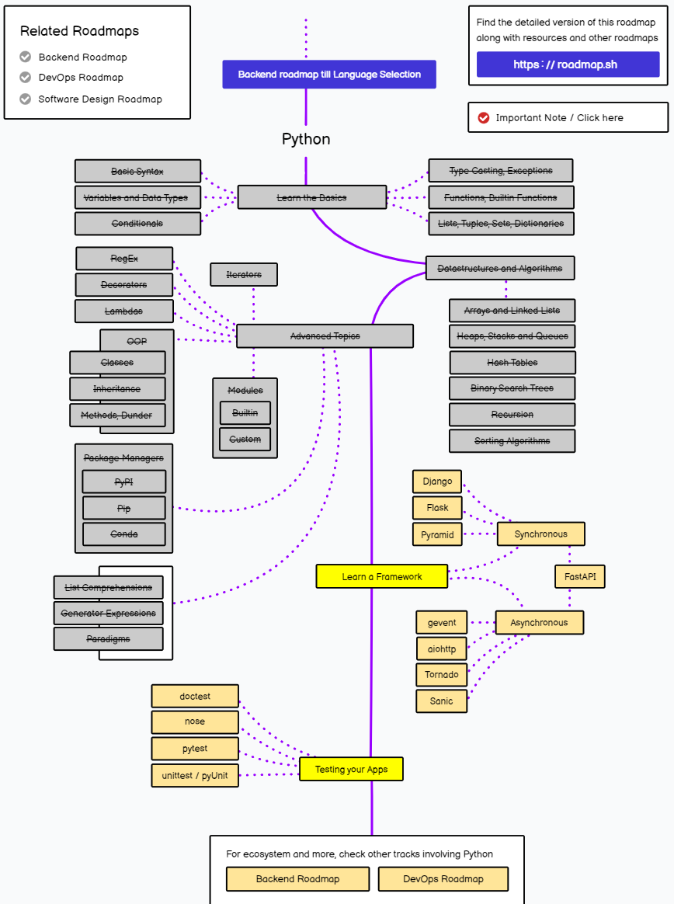

# Roadmap - Python

## This repo is set up to follow my progress as I learn Python from the ground up. I have a little history with Python, but only at a very surface level so I'm documenting my learning as I go

---

### I'm using this [Python Roadmap](roadmap.sh/python) as a guide, starting with data structures and continuing from there. Please feel free to provide **constructive** criticisms by reaching out to me on [Instagram](https://www.instagram.com/will_spencer171) or [LinkedIn](https://www.linkedin.com/in/willspencer171)

> - [Data Structures](https://github.com/willspencer171/python_roadmap/tree/master/Data%20Structures)
>   - [Binary Search Tree](https://github.com/willspencer171/python_roadmap/tree/master/Data%20Structures/Binary%20Search%20Tree)
>   - [Hash Tables](https://github.com/willspencer171/python_roadmap/tree/master/Data%20Structures/Hash%20Tables)
>   - [Queues](https://github.com/willspencer171/python_roadmap/tree/master/Data%20Structures/Queues)
>   - [Recursion](https://github.com/willspencer171/python_roadmap/tree/master/Data%20Structures/Recursion/recursion.py)
>   - [Sorting Algorithms](https://github.com/willspencer171/python_roadmap/tree/master/Data%20Structures/Sorting%Algorithms)
> - [Advanced Topics](https://github.com/willspencer171/python_roadmap/tree/master/Advanced%20Topics)
>   - [Decorators](https://github.com/willspencer171/python_roadmap/tree/master/Advanced%20Topics/decorators.py)
>   - [Iterators](https://github.com/willspencer171/python_roadmap/tree/master/Advanced%20Topics/iterators.py)
>   - [Lambdas](https://github.com/willspencer171/python_roadmap/tree/master/Advanced%20Topics/lambdas.py)
>   - [Regex](https://github.com/willspencer171/python_roadmap/tree/master/Advanced%20Topics/regex.py)
>   - [OOP](https://github.com/willspencer171/python_roadmap/tree/master/Advanced%20Topics/OOP)

## What I'm Up To

